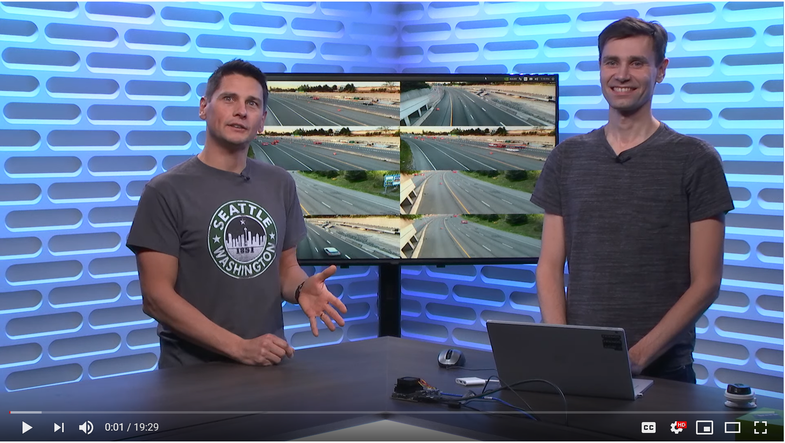
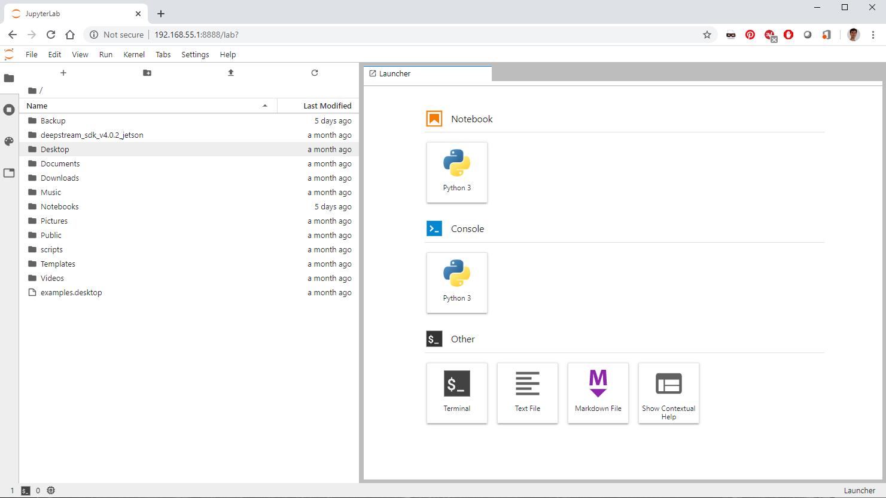
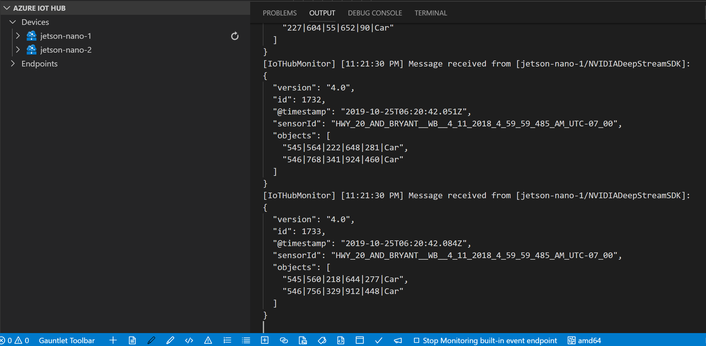

# NVIDIA Deepstream + Azure IoT Edge on a NVIDIA Jetson Nano

This is a sample showing how to do real-time video analytics with [NVIDIA Deepstream](https://developer.nvidia.com/Deepstream-sdk) on a [NVIDIA Jetson Nano device](https://developer.nvidia.com/embedded/buy/jetson-nano-devkit) connected to Azure via [Azure IoT Edge](https://azure.microsoft.com/en-us/services/iot-edge/). Deepstream is a highly-optimized video processing pipeline, capable of running deep neural networks. It is a must-have tool whenever you have complex video analytics requirements, whether its real-time or with cascading AI models. IoT Edge gives you the possibility to run this pipeline next to your cameras, where the video data is being generated, thus lowering your bandwitch costs and enabling scenarios with poor internet connectivity or privacy concerns. With this solution, you can transform cameras into sensors to know when there is an available parking spot, a missing product on a retail store shelf, an anomaly on a solar panel, a worker approaching a hazardous zone, etc.

To complete this sample, you need a [NVIDIA Jetson Nano device](https://developer.nvidia.com/embedded/buy/jetson-nano-devkit). This device is powerful enough to process 8 video streams at a resolution of 1080p, 30 frames-per-second with a resnet10 model and is compatible with IoT Edge. If you need to process more video streams, the same code works with more powerful NVIDIA Jetson devices like the [TX2](https://developer.nvidia.com/embedded/buy/jetson-tx2) or the [Xavier](https://developer.nvidia.com/embedded/buy/jetson-agx-xavier-devkit), and with server-class appliances that includes [NVIDIA T4](https://www.nvidia.com/en-us/data-center/tesla-t4/) or other NVIDIA Tesla GPUs.

Check out [this video](https://www.youtube.com/watch?v=475nlIETSkw) to see this demo in action and understand how it was built:

[](https://www.youtube.com/watch?v=475nlIETSkw)

## Prerequisites

- **Hardware**: You need a [NVIDIA Jetson Nano device](https://developer.nvidia.com/embedded/buy/jetson-nano-devkit) ideally with a [5V-4A barrel jack power supply like this one](https://www.adafruit.com/product/1466), which requires a jumper cable (such as [these ones](https://www.amazon.com/120pcs-Multicolor-Jumper-Arduino-Raspberry/dp/B01BAXKDN4/ref=asc_df_B01BAXKDN4/?tag=hyprod-20&linkCode=df0&hvadid=198075247191&hvpos=1o1&hvnetw=g&hvrand=12715964868364075974&hvpone=&hvptwo=&hvqmt=&hvdev=c&hvdvcmdl=&hvlocint=&hvlocphy=9033288&hvtargid=pla-317965496827&psc=1)) on pins J48. See the [Power Guide section of the Jetson Nano Developer Kit](https://developer.nvidia.com/embedded/dlc/jetson-nano-dev-kit-user-guide) for more details. Alternatively, a 5V-2.5A Micro-USB power supply will work without a jumper cable but may limit the performance of your Deepstream application. In all cases, please make sure to use the default `Max` power source mode (e.g. 10W). To visualize the video feeds, you'll need an HDMI monitor and cable connected to your NVIDIA Jetson Nano.
- **Flash your Jetson Nano SD Card**: download and flash either this [JetPack version 4.3 image](https://developer.nvidia.com/embedded/jetpack) if you have an HDMI screen or the [image from this NVIDIA course](https://courses.nvidia.com/courses/course-v1:DLI+C-IV-02+V1/info) otherwise (the course is a great free learning resource anyway). The image from the course is also based on JetPack 4.3 but includes an USB Device Mode to use the Jetson Nano without HDMI screen. For the rest of this tutorial will assume that you use the device in USB Device Mode. In any cases, you can use [BalenaEtcher](https://www.balena.io/etcher/) tool to flash your SD card. Both of these images are based on Ubuntu 18.04 and already includes NVIDIA drivers version, CUDA and Nvidia-Docker. 

> [!WARNING]
> This branch only works with DeepStream 4.0.2, which requires JetPack 4.3 (= Release 32, Revision 3). To use DeepStream 4.0.1 with JetPack 4.2, please look at the `ds-4.0.1` branch of this repo. To double check, your JetPack version, you can use the following command:


```bash
head -n 1 /etc/nv_tegra_release
```

- **Connect your Jetson Nano to your developer's machine with the USB Device Mode**: we'll do that by plugging a micro-USB cable from your Jetson Nano to your developer's machine and using the USB Device Mode provided in NVIDIA's course base image. With this mode, you do not need to hook up a monitor directly to your Jetson Nano. Instead, boot your device and wait for 30 seconds then open yoru favorite browser, go to [http://192.168.55.1:8888](http://192.168.55.1:8888) and enter the password `dlinano` to get access to a command line on your Jetson Nano.



- **Connect your Jetson Nano to the internet**: Either use an ethernet connection, in which case you can skip this section or connect your device to WiFi using the above USB Device Mode terminal:

    To connect your Jetson to a WiFi network from a terminal, follow these steps

    1. Re-scan available WiFi networks

        ```bash
        nmcli device wifi rescan
        ```

    2. List available WiFi networks, and find the ``ssid_name`` of your network.

        ```bash
        nmcli device wifi list
        ```

    3. Connect to a selected WiFi network

        ```bash
        nmcli device wifi connect <ssid_name> password <password>
        ```

- **Connect your Jetson Nano to an SSH client**: The USB Device Mode terminal is limited because it does not support copy/paste. So to make it easier to go through the steps of this sample, it is recommended to open an SSH connection with your favorite SSH Client. 

    1. Find your IP address using the USB Device Mode terminal

        ```bash
        ifconfig
        ```

    2. Make sure that your laptop is on the same network as yoru Jetson Nano device and open an SSH connection on your Jetson Device (password = `dlinano`):

        ```bash
        ssh dlinano@your-ip-address
        ```

- **Install IoT Edge**: See the [Azure IoT Edge installation instructions](https://docs.microsoft.com/en-us/azure/iot-edge/how-to-install-iot-edge-linux) for Ubuntu Server 18.04. Skip the Install Container Runtime section since we will be using nvidia-docker, which is already installed. Connect your device to your IoT Hub using the manual provisioning option. See this [quickstart](https://docs.microsoft.com/en-us/azure/iot-edge/quickstart-linux) if you don't yet have an Azure IoT Hub.
- **Install VS Code and its the IoT Edge extension on your developer's machine**: On your developer's machine, get [VS Code](https://code.visualstudio.com/) and its [IoT Edge extension](https://marketplace.visualstudio.com/items?itemName=vsciot-vscode.azure-iot-tools#overview). [Configure this extension with your IoT Hub](https://docs.microsoft.com/en-us/azure/iot-edge/how-to-deploy-modules-vscode#sign-in-to-access-your-iot-hub).
- **Install VLC to view RTSP video streams**: On your developer's machine, [install VLC](https://www.videolan.org/vlc/index.html).


The next sections walks you step-by-step to deploy Deepstream on an IoT Edge device and update its configuration. It explains concepts along the way. If all you want is to see the 8 video streams being processed in parallel, you can jump right to the final demo by directly deploying the deployment manifest in this repo.

## Deploy Deepstream from the Azure Marketplace

We'll start by creating a new IoT Edge solution in VS Code, add the Deepstream module from the marketplace and deploy that to our Jetson Nano.

Note that you could also find Deepstream's module via the [Azure Marketplace website here](https://azuremarketplace.microsoft.com/en-us/marketplace/apps/nvidia.deepstream-iot). You'll use VS code here since Deepstream is an SDK and typically needs to be tweaked or connected to custom modules to deliver an end-to-end solution at the edge.

In VS Code, from your development machine:

1. Start by creating a new IoT Edge solution:
    1. Open the command palette (Ctrl+Shift+P)
    2. Select `Azure IoT Edge: New IoT Edge Solution`
    3. Select a parent folder
    4. Give it a name.
    5. Select `Empty Solution` (if prompted, accept to install iotedgehubdev)
	
2. Add the Deepstream module to your solution:
    1. Open the command palette (Ctrl+Shift+P)
    2. Select `Azure IoT Edge: Add IoT Edge module`
    3. Select the default deployment manifest (deployment.template.json)
    4. Select `Module from Azure Marketplace`.
    5. It opens a new tab with all IoT Edge module offers from the Azure Marketplace. Select the `Nvidia Deepstream SDK` one, select the NVIDIA DeapStream SDK 4.0.2 for Jetson plan and select the `latest` tag.


3. Deploy the solution to your device:
    1. `Generate IoT Edge Deployment Manifest` by right clicking on the deployment.nano.template.json file
    2. `Create Deployment for Single Device` by right clicking on the generated file in the /config folder
    3. Select your IoT Edge device

4. Start monitoring the messages sent from the device to the cloud
    1. Right-click on your device (bottom left corner)
    2. Select `Start Monitoring Built-In Event Endpoint`

After a little while, (enough time for IoT Edge to download and start DeepStream module which is 1.75GB and compile the AI model), you should be able to see messages sent by the Deepstream module to the cloud via the IoT Edge runtime in VS Code. These messages are the results of Deepstream processing a sample video and analyzing it with an sample AI model that detects people and cars in this video and sends a message for each object found.



## View the processed videos

We'll now modify the configuration of the Deepstream application and the IoT Edge deployment manifest to be able to see the output video streams. We'll do that by asking Deepstream to output the inferred videos to an RTSP video stream and visualize this RTSP stream with VLC.

1. Create your updated Deepstream config file on your Nano device:
    a. Open an SSH connection on your Nano device (for instance from VS Code terminal):
    
    ```cmd
    ssh dlinano@your-nano-ip-address
    ```

    2. Create a new folder to host modified Deepstream config files

    ```bash
    cd /var
    sudo mkdir deepstream
    mkdir ./deepstream/custom_configs
    sudo chmod -R 777 /var/deepstream
    cd ./deepstream/custom_configs
    ```

    3. Use your favorite text editor to create a copy of the sample Deepstream configuration file:
         - Create and open a new file:

        ```bash
        nano test5_config_file_src_infer_azure_iotedge_edited.txt
        ```

        - Copy the content of the original Deepstream configuration file which you can find in this repo under `test5_config_file_src_infer_azure_iotedge.txt`

    4. Edit the configuration file:
        - Disable the first sink (FakeSink) and add a new RTSP sink with the following properties:
        
        ```bash
        [sink0]
        enable=0
        ```

        ```bash
        [sink3]
        enable=1
        #Type - 1=FakeSink 2=EglSink 3=File 4=RTSPStreaming
        type=4
        #1=h264 2=h265
        codec=1
        sync=0
        bitrate=4000000
        # set below properties in case of RTSPStreaming
        rtsp-port=8554
        udp-port=5400
        ```

        - Reduce the number of inferences to be every 3 frames (see `interval` property) otherwise the Nano will drop some frames. In the next section, we'll use a Nano specific config to process 8 video streams in real-time:

        ```
        [primary-gie]
        enable=1
        gpu-id=0
        batch-size=4
        ## 0=FP32, 1=INT8, 2=FP16 mode
        bbox-border-color0=1;0;0;1
        bbox-border-color1=0;1;1;1
        bbox-border-color2=0;1;1;1
        bbox-border-color3=0;1;0;1
        nvbuf-memory-type=0
        interval=2
        ```

        - To make it easier to connect to the output RTSP stream, let's set DeepStream to continuously loop over the test input video files:

        ```
        [tests]
        file-loop=1
        ```

        - Save and Quit (CTRL+O, CTRL+X)

2. Mount your updated config file in the Deepstream module by adding its createOptions in the `deployment.template.json` file from your development's machine:
    - Add the following to your Deepstream createOptions:

    ```json
    "HostConfig":{
        "Binds": ["/var/deepstream/custom_configs:/root/deepstream_sdk_v4.0.2_jetson/sources/apps/sample_apps/deepstream-test5/custom_configs/"]
        }
    ```

    - Edit your Deepstream application working directory and entrypoint to use this updated config file via Deepstream createOptions:
    
    ```json
    "WorkingDir": "/root/deepstream_sdk_v4.0.2_jetson/sources/apps/sample_apps/deepstream-test5/custom_configs/"
    ```

    ```json
    "Entrypoint":["/usr/bin/deepstream-test5-app","-c","test5_config_file_src_infer_azure_iotedge_edited.txt"]
    ```

3. Open the RTSP port of DeepStream module so that you can visualize this feed from another device:
    - Add the following to your Deepstream createOptions, at the root:

    ```json
    "ExposedPorts":{
        "8554/tcp": {}
    }
    ```

    - Add the following to your Deepstream createOptions, in the `HostConfig` node:

    ```json
    "PortBindings": {
        "8554/tcp": [
            {
            "HostPort": "8554"
            }
        ]
    }
    ```

4. Deploy your updated IoT Edge solution:
    1. `Generate IoT Edge Deployment Manifest` by right clicking on the deployment.template.json file
    2. `Create Deployment for Single Device` by right clicking on the generated file in the /config folder
    3. Select your IoT Edge device
    4. Start monitoring the messages sent from the device to the cloud by right clicking on the device (bottom left corner) and select `Start Monitoring Built-In Event Endpoint`

5. Finally, open the default output RTSP stream generated by DeepStream with VLC:
    1. Open VLC
    2. Go to `Media` > `Open Network Stream`
    3. Paste the default `RTSP Video URL` generated by deepstream,  which follows the format `rtsp://your-nano-ip-address:8554/ds-test`
    4. Click `Play`

You should now see messages recevied by IoT Hub via in VS Code AND see the processed video on your screen.


## Process and view 8 video streams (1080p 30fps)

We'll now update Deepstream's configuration to process 8 video streams concurrently (1080p 30fps).

We'll start by updating the batch-size to 8 instead of 4 (`primagy-gie` / `batch-size` property). Then because Tthe Jetson Nano isn't capable of doing inferences on 240 frames per second with a ResNet10 model, we will instead run inferences every 5 frames (`primagy-gie` / `interval` property) and use Deepstream's built-in tracking algorithm for in-between frames, which is less computationnally intensive (`tracker` group). We'll also use a slightly lower inference resolution (defined via `primagy-gie` / `config-file` property). These changes are captured in the Deepstream configuration file below specific to Nano.

1. Update your previously edited Deepstream config file:
    - Open your previous config file:

    ```bash
    nano test5_config_file_src_infer_azure_iotedge_edited.txt
    ```

    - Copy the content of Deepstream's configuration file named `test5_config_file_src_infer_azure_iotedge_nano_8sources.txt` from this repo

    - Save and Quit (CTRL+O, CTRL+X)

2. To simulate 8 video cameras, download and add to Deepstream 8 videos files
    - Open an ssh connection on your Nano device:

    ```cmd
    ssh username@deviceName
    ```

    - Host these video files on your local disk

    ```bash
    cd /var/deepstream
    mkdir custom_streams
    sudo chmod -R 777 /var/deepstream
    cd ./custom_streams
    ```

    - Download the video files

    ```bash
    wget -O cars-streams.tar.gz --no-check-certificate "https://onedrive.live.com/download?cid=0C0A4A69A0CDCB4C&resid=0C0A4A69A0CDCB4C%21588371&authkey=AAavgrxG95v9gu0"
    ```

    - Un-compress the video files

    ```bash
    tar -xzvf cars-streams.tar.gz
    ```

    - Mount these video streams by adding the following binding via the `HostConfig` node of Deepstream's  createOptions:

    ```json
    "Binds": [
            "/var/deepstream/custom_configs/:/root/deepstream_sdk_v4.0.2_jetson/sources/apps/sample_apps/deepstream-test5/custom_configs/",
            "/var/deepstream/custom_streams/:/root/deepstream_sdk_v4.0.2_jetson/sources/apps/sample_apps/deepstream-test5/custom_streams/"
            ]
    ```

3. Verify that your are still using your updated configuration file and still expose Deepstream's RTSP port (8554). You can double check your settings by comparing your deployment file to the one in this repo.
4. To speed up IoT Edge message throughput, configure the edgeHub to use an in-memory store. In your deployment manifest, set the `usePersistentStorage` environment variable to `false` in edgeHub configuration (next to its `settings` node) and disable unused protocol heads (DeepStream uses MQTT to communicate with the EdgeHub):

    ```json
    "edgeHub": {
                    "env": {
                      "usePersistentStorage": {
                        "value": "false"
                      },
                      "amqpSettings__enabled": {
                        "value": false
                      },
                      "httpSettings__enabled": {
                        "value": false
                      }
                    }
    ```

5. Finally, deploy your updated IoT Edge solution:
    1. `Generate IoT Edge Deployment Manifest` by right clicking on the deployment.template.json file
    2. `Create Deployment for Single Device` by right clicking on the generated file in the /config folder
    3. Select your IoT Edge device
    4. Start monitoring the messages sent from the device to the cloud by right clicking on the device (bottom left corner) and select `Start Monitoring Built-In Event Endpoint`

You should now see the 8 video streams being processed and displayed on your screen.


## Going further

### Learning more about DeepStream

A great learning resource to learn more about DeepStream is [this free online course by NVIDIA](https://courses.nvidia.com/courses/course-v1:DLI+C-IV-02+V1/info).

Deesptream's SDK based on GStreamer. It is very modular with its concepts of plugins. Each plugins has `sinks` and `sources`. NVIDIA provides several plugins as part of Deepstream which are optimized to leverage NVIDIA's GPUs. How these plugins are connected with each others is defined in the application's  configuration file.

You can learn more about its architecture in [NVIDIA's official documentation](https://docs.nvidia.com/metropolis/Deepstream/dev-guide/index.html#page/DeepStream_Development_Guide%2FDeepstream_app_architecture.html) (sneak peak below).


### Tips to edit your DeepStream application

#### Make a quick configuration change

To quickly change a value in your config file, leverage the fact that it is being mounted from a local file so all you have to do is (for instance via an ssh terminal):

1. Open your config file (in `/var/deepstream/custom_configs` in this sample)
2. Make your changes and save
3. Restart Deepstream container

    ```bash
    iotedge restart NVIDIADeepStreamSDK
    ```

This assumes that you did not change any file names and thus the same IoT Edge deployment manifest applies.

#### Use your own source videos and / or AI models

To use your own source videos and AI models and quickly iterate on them, you can use the same technique used in this sample:  mounting local folders with these assets. By doing that, you can quickly iterate on your assets, without any code change or re-compilation.

#### Use live RTSP streams as inputs

It is a very common configuration to have DeepStream take several live RTSP streams as inputs. All you have to do is modify DeepStream's configuration file and update its [source group](https://docs.nvidia.com/metropolis/deepstream/dev-guide/index.html#page/DeepStream_Development_Guide%2Fdeepstream_app_config.3.2.html%23wwpID0E0QB0HA):

```txt
type=4
uri=rtsp://127.0.0.1:554/rtsp_path
```

and update its [streammux group](https://docs.nvidia.com/metropolis/deepstream/dev-guide/index.html#page/DeepStream_Development_Guide%2Fdeepstream_app_config.3.2.html%23wwpID0E0DB0HA):

```txt
live-source=1
```

To output an RTSP stream with the final result, Deepstream can output RTSP videos on Tesla platforms but not on Jetson platforms for now. There is currently a limitation on RTSP encoding on Jetson platforms.

#### Learn all the configuration options available from Deepstream's documentation

Deepstream supports a wide varity of options, a lot of which are available via configuraiton changes. To learn more about them, go to Deepstream's documentation:
- [Configuration groups](https://docs.nvidia.com/metropolis/Deepstream/dev-guide/index.html#page/DeepStream_Development_Guide%2FDeepstream_app_config.3.2.html) documents all configuration options for each out-of-box plugin
- [Application tuning](https://docs.nvidia.com/metropolis/Deepstream/dev-guide/index.html#page/DeepStream_Development_Guide%2FDeepstream_app_config.3.3.html) provides application tuning tips

#### Troubleshoot your DeepStream module

To debug your DeepStream module, look at the last 200 lines of its logs:

```bash
iotedge logs NVIDIADeepStreamSDK --tail 200 -f
```

#### Verify your Deepstream module docker options

Sometimes it is helpful to verify the options that Docker took into account when creating your Deepstream container via IoT Edge. It is particularly useful to double-check the folders that have been mounted in your container. The simplest way to do that is to use the `docker inspect` command:

```bash
sudo docker inspect NVIDIADeepStreamSDK
```

## F. A.Q. 

### Is Moby officially supported with DeepStream and IoT Edge?

While Moby does, IoT Edge does not yet support the new way to mount NVIDIA GPUs into a Docker container. This support is planned with release 1.0.10 of IoT Edge for early 2020. For now, you still need to use the previous [nvidia-docker](https://github.com/NVIDIA/nvidia-docker) runtime with Docker CE, which is installed by default on Jetson Nano. That's why Deepstream SDK on IoT Edge is currently in preview.

### Which AI models does Deepstream support? 

Deepstream relies on [NVIDIA TensorRT](https://docs.nvidia.com/deeplearning/sdk/tensorrt-developer-guide/index.html) in do the inferencing. Thus any AI models supported by TensorRT is supported with Deepstream. In practice, most of AI models are supported by TensorRT. See this [list of all layers supported by TensorRT](https://docs.nvidia.com/deeplearning/sdk/tensorrt-developer-guide/index.html#layers).

Of course it accepts AI models in TensorRT format but can also convert TensorFlow and ONNX models (see [this documentation](https://docs.nvidia.com/deeplearning/sdk/tensorrt-developer-guide/index.html#api) for more details on the ONNX -> TensorRT parser). Conversion is done automatically when launching the application.

You can thus build your AI model with Azure Machine Learning and work with ONNX format or use [Custom Vision](https://www.customvision.ai/) with their ONNX export. Instructions to use Custom Vision will soon be added to this repo.

You can also use pre-built models made freely available by NVIDIA [here](https://ngc.nvidia.com/catalog/models?orderBy=modifiedDESC&query=resnet&quickFilter=models&filters=) and customize them using [NVIDIA's Transfer Learning Toolkit](https://docs.nvidia.com/metropolis/TLT/tlt-getting-started-guide/index.html).

### How to format IoT Edge messages?

The `Gst-nvmsgbroker` plugin is the one sending output messages. Its full documentation is available [here](https://docs.nvidia.com/metropolis/Deepstream/plugin-manual/index.html#page/DeepStream_Plugin_Manual%2FDeepstream_plugin_details.02.15.html%23).

By default, you can use the `topic` property in Deepstream to set up the output of the Deepstream modules and define your [routes](https://docs.microsoft.com/en-us/azure/iot-edge/module-composition#declare-routes) in IoT Edge appropriately.

### How to manage AI model versions at scale?

Iterating on a local model & config file locally and bind mounting them to the container is only recommended during active development, but it does not scale. To manage your application (AI model & config files artifacts in particular), you have two options:

1. Package everything into one container. Have the artifacts you expect to change regularly like your AI model and config files in the latest layers of your docker container so that most of your docker image remains unchanged when updating those. Each model change will require a new module update.
2. Use a separate 'artifacts' module to deliver these artifacts and bind mount them to the Deepstream module. That way you can use either [twins](https://docs.microsoft.com/en-us/azure/iot-hub/iot-hub-devguide-module-twins) or your own methods to configure your 'artifacts' module at scale.

### Why is Deepstream running as one IoT Edge module with its own plugins vs plugins in different modules?

Deepstream does a lot of optimizations to be able to handle many video streams such as:

- zero in-memory copy, which is much easier to achieve from the same container
- pushing the entire pipeline on a GPU card, which requires the entire pipeline to be part of the same container to avoid hardware access conflicts

These types of optimizations only work when the entire pipeline is running in the same container and thus as one IoT Edge module. The output of Deepstream module can however be sent to other modules running on the same device, typically to run some business logic code or filtering logic.

### When should you consider building your own Deepstream application vs reconfiguring an existing one?

For some use cases, the default Deepstream app is not enough. Whenever the changes are required in the plugin pipeline, configuration changes are not enough and a Deepstream app needs to be re-compiled.

A common example of a different pipeline is to have cascading AI models(ex: AI 1- detect a package, AI 2- detect a barcode, etc.).

To build your own Deepstream application or even build your own Deepstream plugin, you can follow this link: [Deepstream documentation](https://docs.nvidia.com/metropolis/Deepstream/dev-guide/index.html#page/DeepStream_Development_Guide%2FDeepstream_custom_plugin.html%23wwpID0E0TB0HA).

### What performance charateristics can you expect from Deepstream application across NVIDIA GPUs?

NVIDIA published some performance benchmarks on their [documentation website](https://docs.nvidia.com/metropolis/Deepstream/dev-guide/index.html#page/DeepStream_Development_Guide%2FDeepstream_performance.html).

## Contributing

This project welcomes contributions and suggestions. Most contributions require you to agree to a Contributor License Agreement (CLA) declaring that you have the right to, and actually do, grant us the rights to use your contribution. For details, visit https://cla.opensource.microsoft.com.

When you submit a pull request, a CLA bot will automatically determine whether you need to provide a CLA and decorate the PR appropriately (e.g., status check, comment). Simply follow the instructions provided by the bot. You will only need to do this once across all repos using our CLA.

This project has adopted the Microsoft Open Source Code of Conduct. For more information see the Code of Conduct FAQ or contact opencode@microsoft.com with any additional questions or comments.
